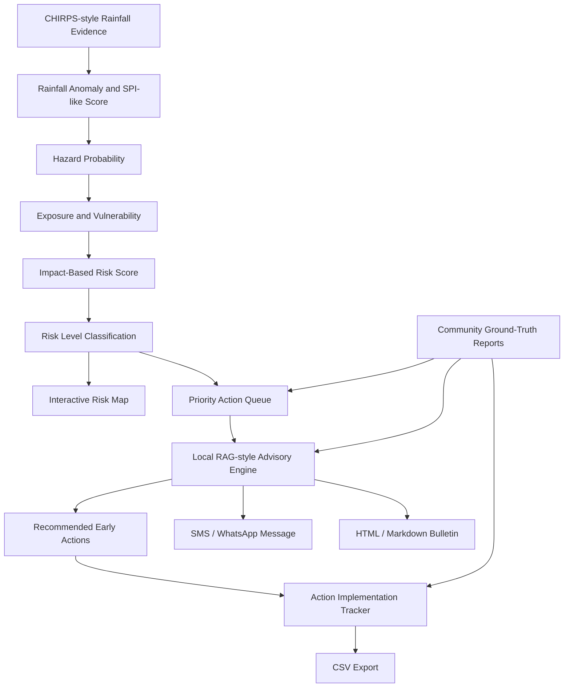

# Forecast2Action AI — Hackathon Submission

## 1. Project Title

**Forecast2Action AI**

---

## 2. Tagline

**Smarter Early Warning, Stronger Communities**

---

## 3. One-Sentence Summary

Forecast2Action AI is an AI-enabled early warning copilot that converts climate risk signals into explainable advisories, priority actions, community messages, implementation tasks, and operational bulletins for climate-vulnerable districts in the IGAD region.

---

## 4. Problem Statement

Across the IGAD region, communities are increasingly affected by drought, floods, heat stress, food insecurity, livestock stress, and climate-related livelihood shocks. Climate and early warning institutions often generate forecasts, rainfall maps, anomaly products, and hazard outlooks, but decision-makers still face a major operational gap:

**How do we move from forecast information to timely, localized, accountable action?**

Many early warning workflows stop at the level of forecast products or risk maps. Local decision-makers, NGOs, disaster risk managers, agriculture and livestock officers, and community focal persons still need to answer practical questions:

- Which district should be prioritized first?
- What does the forecast mean for exposed and vulnerable communities?
- What action should be taken now?
- Which sector is responsible?
- What should be communicated to communities?
- Are community reports confirming the forecast signal?
- How can action progress be tracked?
- Can a clear bulletin be generated quickly?

Forecast2Action AI addresses this gap by connecting climate evidence directly to action planning and last-mile communication.

---

## 5. Solution Overview

Forecast2Action AI is a working prototype that transforms climate risk information into operational early action guidance.

The system integrates:

- CHIRPS-style rainfall anomaly and SPI-like climate evidence;
- exposure, vulnerability, and forecast confidence indicators;
- impact-based district risk scoring;
- interactive geospatial risk visualization;
- priority action ranking;
- local RAG-style advisory generation from an Action Knowledge Base;
- audience-specific recommendations;
- multilingual SMS / WhatsApp-ready messages;
- community ground-truth reporting;
- persistent action implementation tracking;
- downloadable early warning bulletins;
- CSV export for operational follow-up.

The result is a practical decision-support workflow that helps move from:

```text
Forecast → Risk → Advisory → Action → Tracking → Communication
```

---

## 6. How AI Is Used

Forecast2Action AI uses a transparent local RAG-style advisory engine.

Instead of producing unsupported generic recommendations, the system retrieves relevant early action guidance from a structured local Action Knowledge Base.

The retrieval logic uses:

- hazard type;
- risk level;
- target audience;
- rainfall anomaly;
- SPI-like score;
- exposure and vulnerability context;
- community feedback signal.

The system then generates:

- recommended early actions;
- role-specific advisory text;
- explanation of why specific guidance was selected;
- knowledge source summaries;
- community-ready messages;
- implementation tasks.

This approach is suitable for high-stakes early warning because it is:

- explainable;
- locally controlled;
- auditable;
- human-in-the-loop friendly;
- adaptable to national and regional early warning protocols.

---

## 7. Target Users

Forecast2Action AI is designed for:

- national meteorological and hydrological services;
- disaster risk management agencies;
- agriculture and livestock extension officers;
- water and health sector planners;
- NGOs and anticipatory action partners;
- district-level coordination teams;
- community early warning focal persons;
- regional institutions supporting climate resilience in the IGAD region.

---

## 8. Key Features

### 8.1 Climate Evidence Pipeline

The prototype generates district-level rainfall indicators, including:

- seasonal rainfall;
- baseline mean rainfall;
- rainfall anomaly in millimeters;
- rainfall anomaly percentage;
- SPI-like standardized rainfall score;
- hazard classification;
- hazard probability.

### 8.2 Impact-Based Risk Scoring

The system combines:

```text
40% hazard probability
25% exposure
25% vulnerability
10% forecast confidence
```

to generate an impact-based risk score and classify each district into:

- no alert;
- watch;
- warning;
- trigger.

### 8.3 Interactive Risk Map

An interactive Leaflet map shows the spatial distribution of hazard risk across pilot districts. Users can click districts to update the advisory, action tracker, reports, and bulletin context.

### 8.4 Priority Action Queue

The system ranks districts by risk score and community feedback, helping decision-makers identify where early action should be prioritized first.

### 8.5 Local RAG-style Advisory Engine

A local Action Knowledge Base supports retrieval of relevant early action guidance. The engine selects guidance based on the current risk context and target audience.

### 8.6 Audience-Specific Advisory

Users can switch advisory outputs for:

- Disaster Risk Manager;
- NGO / Anticipatory Action Planner;
- Agriculture and Livestock Extension Officer;
- Community Member.

### 8.7 Multilingual Community Messages

The system generates SMS / WhatsApp-ready messages in:

- English;
- Amharic;
- Swahili.

### 8.8 Community Ground-Truth Reporting

Users can submit field observations, such as:

- water shortage;
- crop wilting;
- poor pasture condition;
- livestock stress;
- flooded roads;
- river overflow;
- unusual heat;
- disease concern;
- market disruption.

These reports strengthen the advisory and priority ranking.

### 8.9 Action Implementation Tracker

Recommended early actions are converted into operational tasks with:

- responsible sector;
- priority;
- suggested deadline;
- implementation status;
- timestamp;
- update user.

Task status is persistent and stored locally.

### 8.10 Bulletin Export

The system generates operational early warning bulletins in:

- HTML;
- Markdown.

The HTML bulletin includes a Print / Save as PDF option.

### 8.11 CSV Export

The Action Implementation Tracker can be exported as CSV for sharing with coordination teams, sector offices, and humanitarian partners.

---

## 9. Technical Architecture

```text
Climate Evidence Pipeline
        ↓
Rainfall Anomaly and SPI-like Indicator
        ↓
Hazard Probability Estimation
        ↓
Exposure + Vulnerability + Confidence
        ↓
Impact-Based Risk Scoring
        ↓
Risk Map + Priority Queue
        ↓
Local RAG-style Action Knowledge Retrieval
        ↓
Audience-Specific Advisory
        ↓
Community Message + Action Tracker + Bulletin Export
```

---

## 10. System Workflow Diagram



---

## 11. Technology Stack

### Backend

- Python
- FastAPI
- Pandas
- Pydantic
- JSON-based local storage
- CSV export
- HTML / Markdown bulletin generation

### Frontend

- React
- Vite
- Leaflet
- React Leaflet
- CSS

### Data and Knowledge

- CHIRPS-style rainfall anomaly pipeline
- SPI-like rainfall indicator
- local Action Knowledge Base
- community reports JSON store
- persistent task status JSON store

---

## 12. Current Prototype Scope

The MVP currently supports selected pilot districts in Ethiopia and Kenya:

| Country | District | Example Risk |
|---|---|---|
| Ethiopia | Borena | Drought |
| Ethiopia | Afar Zone 1 | Rainfall / heat-related risk |
| Kenya | Turkana | Drought |
| Kenya | Garissa | Heavy rainfall |

The prototype is designed so that additional districts, countries, hazards, and knowledge-base actions can be added.

---

## 13. Demo Workflow

A typical demo follows this sequence:

1. Open the Forecast2Action AI dashboard.
2. Select a district, such as Borena.
3. Review the climate evidence: rainfall anomaly and SPI-like score.
4. Review the impact-based risk score and risk level.
5. View the selected district on the interactive risk map.
6. Review the priority action queue.
7. Select an audience, such as Disaster Risk Manager.
8. Review the knowledge-guided advisory.
9. Submit a community ground-truth report.
10. Observe how the feedback signal updates.
11. Review recommended early actions.
12. Review the Action Implementation Tracker.
13. Change task status to In progress or Completed.
14. Download the early warning bulletin.
15. Export the Action Tracker as CSV.

---

## 14. 2-Minute Pitch Script

**Opening**

Forecast2Action AI is an early warning copilot that helps decision-makers move from climate risk signals to practical early action.

Across the IGAD region, climate institutions produce valuable forecasts and hazard information. But there is still a major operational gap: once a forecast is available, local teams still need to know what action to take, who should act, how urgent it is, and what message should reach communities.

**Problem**

Many early warning systems stop at maps or bulletins. Forecast2Action AI goes further by helping users turn climate evidence into action.

**Solution**

The system starts with district-level rainfall evidence, including rainfall anomaly and an SPI-like score. It combines hazard probability with exposure, vulnerability, and forecast confidence to produce an impact-based risk score.

The dashboard then shows an interactive risk map and ranks districts in a priority action queue.

**AI Component**

The AI component is a local RAG-style advisory engine. It retrieves relevant early action guidance from a structured Action Knowledge Base using hazard type, risk level, audience, rainfall anomaly, SPI score, and community feedback.

This makes the advisory explainable and grounded.

**Community and Action**

Users can submit community reports, such as water shortage, pasture stress, crop wilting, or flooded roads. These observations strengthen the ground-truth signal.

Recommended actions are converted into implementation tasks with responsible sectors, priorities, deadlines, and saved task status.

**Outputs**

The system generates SMS / WhatsApp-ready community messages, downloadable early warning bulletins, and CSV exports for action tracking.

**Closing**

Forecast2Action AI helps move from early warning to early action, supporting smarter decisions and stronger communities across the IGAD region.

---

## 15. Why It Is Innovative

Forecast2Action AI is innovative because it combines:

- climate evidence;
- impact-based risk scoring;
- geospatial visualization;
- community ground-truth;
- local RAG-style advisory retrieval;
- multilingual messaging;
- implementation tracking;
- operational bulletin generation.

Unlike dashboards that only display risk, Forecast2Action AI supports the full decision cycle from forecast to coordinated action.

---

## 16. Impact for the IGAD Region

Forecast2Action AI can support IGAD countries by helping to:

- translate climate forecasts into sectoral actions;
- strengthen anticipatory action workflows;
- improve coordination between climate, disaster risk management, agriculture, livestock, water, health, and humanitarian sectors;
- improve last-mile early warning communication;
- include community observations in risk decisions;
- generate rapid early warning bulletins;
- track whether recommended actions are being implemented.

The approach can be scaled across IGAD countries by adding:

- more administrative areas;
- real climate datasets;
- country-specific early action protocols;
- multilingual templates;
- national vulnerability datasets;
- integration with existing early warning platforms.

---

## 17. What We Built

The current working MVP includes:

- FastAPI backend;
- React/Vite frontend;
- CHIRPS-style rainfall anomaly pipeline;
- SPI-like rainfall indicator;
- impact-based risk scoring;
- interactive Leaflet risk map;
- priority action queue;
- local RAG-style advisory engine;
- structured Action Knowledge Base;
- audience-specific advisory generation;
- multilingual SMS / WhatsApp-ready messages;
- community reporting;
- persistent action implementation tracker;
- HTML and Markdown bulletin export;
- CSV tracker export.

---

## 18. What Makes the MVP Practical

The prototype is practical because it focuses on the actual operational workflow of early warning:

```text
Detect risk → Explain risk → Recommend action → Assign responsibility → Track status → Communicate clearly
```

It does not only show climate information. It helps users decide and coordinate.

---

## 19. Current Limitations

This is a hackathon MVP, so some elements are prototype-level:

- rainfall data is currently CHIRPS-style sample data rather than live CHIRPS ingestion;
- exposure and vulnerability are sample values;
- the Action Knowledge Base is local and limited;
- community reports are stored in local JSON;
- task tracking is file-based rather than database-backed;
- user authentication is not yet implemented;
- SMS / WhatsApp integration is represented through generated message text;
- real administrative boundary layers are not yet connected.

---

## 20. Future Roadmap

### Near-Term Roadmap

- Replace synthetic rainfall data with real CHIRPS download and zonal statistics;
- add real administrative boundaries;
- connect to PostgreSQL / PostGIS;
- expand the Action Knowledge Base;
- add PDF export;
- add user roles and authentication;
- add real SMS / WhatsApp integration.

### Medium-Term Roadmap

- integrate seasonal forecast products;
- support drought, flood, heat, disease, and food security risk;
- include livestock, crop, population, water, and access vulnerability layers;
- add mobile-friendly reporting;
- support offline-first field reporting;
- add multilingual message templates.

### Long-Term Roadmap

- deploy as a regional early warning decision-support platform;
- integrate with national meteorological agencies and disaster risk management institutions;
- support anticipatory action trigger monitoring;
- add human-in-the-loop validation workflows;
- scale across IGAD countries.

---

## 21. Judging Highlights

### Innovation

Uses local RAG-style AI to translate climate risk into transparent and context-aware early actions.

### Impact

Supports earlier, more coordinated action for drought, flood, heat, agriculture, livestock, water, and community preparedness.

### Technical Strength

Combines FastAPI, React, geospatial visualization, rainfall anomaly analysis, risk scoring, knowledge retrieval, persistent task tracking, and exportable outputs.

### Practicality

Designed around real operational questions: what is the risk, where is it, what should we do, who should act, and how do we track progress?

### Scalability

The architecture can be extended to additional countries, districts, hazards, datasets, and action protocols.

---

## 22. Suggested Devpost Short Description

Forecast2Action AI is an AI-enabled early warning copilot that converts climate risk signals into explainable advisories, priority actions, community messages, operational tasks, and downloadable bulletins. It combines rainfall anomaly evidence, impact-based risk scoring, a local RAG-style Action Knowledge Base, community ground-truth reports, and action implementation tracking to help decision-makers move from forecast to early action across climate-vulnerable areas in the IGAD region.

---

## 23. Suggested Devpost Long Description

Forecast2Action AI addresses a critical gap in early warning systems: many platforms produce forecasts or risk maps, but local decision-makers still need to convert those signals into practical, accountable actions.

The prototype starts with district-level rainfall anomaly and SPI-like climate evidence. It combines hazard probability with exposure, vulnerability, and forecast confidence to generate an impact-based risk score. The results are shown through an interactive risk map and a priority action queue.

The AI component is a local RAG-style advisory engine. It retrieves relevant early action guidance from a structured Action Knowledge Base using hazard type, risk level, audience, rainfall anomaly, SPI-like score, and community feedback. This produces transparent, role-specific recommendations for disaster risk managers, NGO planners, extension officers, and community users.

The platform also includes community ground-truth reporting, multilingual SMS / WhatsApp-ready messages, persistent action implementation tracking, HTML and Markdown bulletin export, and CSV export for operational follow-up.

Forecast2Action AI demonstrates how AI can help close the last-mile gap between climate forecasts and community-level action.

---

## 24. Suggested Demo Video Structure

### Scene 1: Problem

Show that forecasts alone do not answer what action should be taken.

### Scene 2: Dashboard Overview

Show the Forecast2Action AI dashboard, metrics, and risk map.

### Scene 3: Select District

Select Borena or another pilot district and show climate evidence.

### Scene 4: Risk Score

Show the impact-based risk score and trigger level.

### Scene 5: RAG Advisory

Show knowledge-guided advisory and retrieved knowledge sources.

### Scene 6: Community Report

Submit a field observation and show the ground-truth signal.

### Scene 7: Action Tracker

Show generated tasks, sectors, deadlines, and status update.

### Scene 8: Exports

Download bulletin and export action tracker CSV.

### Scene 9: Closing

Explain regional value for IGAD and future scalability.

---

## 25. Team / Author

**Yonas Mersha**  
Climate, Data Science, AI/ML, GIS/Remote Sensing and Early Warning Systems Specialist

Project theme:

```text
Smarter Early Warning, Stronger Communities
```

---

## 26. Final Pitch Sentence

Forecast2Action AI helps institutions and communities move from early warning to early action by transforming climate risk signals into explainable advisories, operational tasks, community messages, and trackable implementation workflows.
