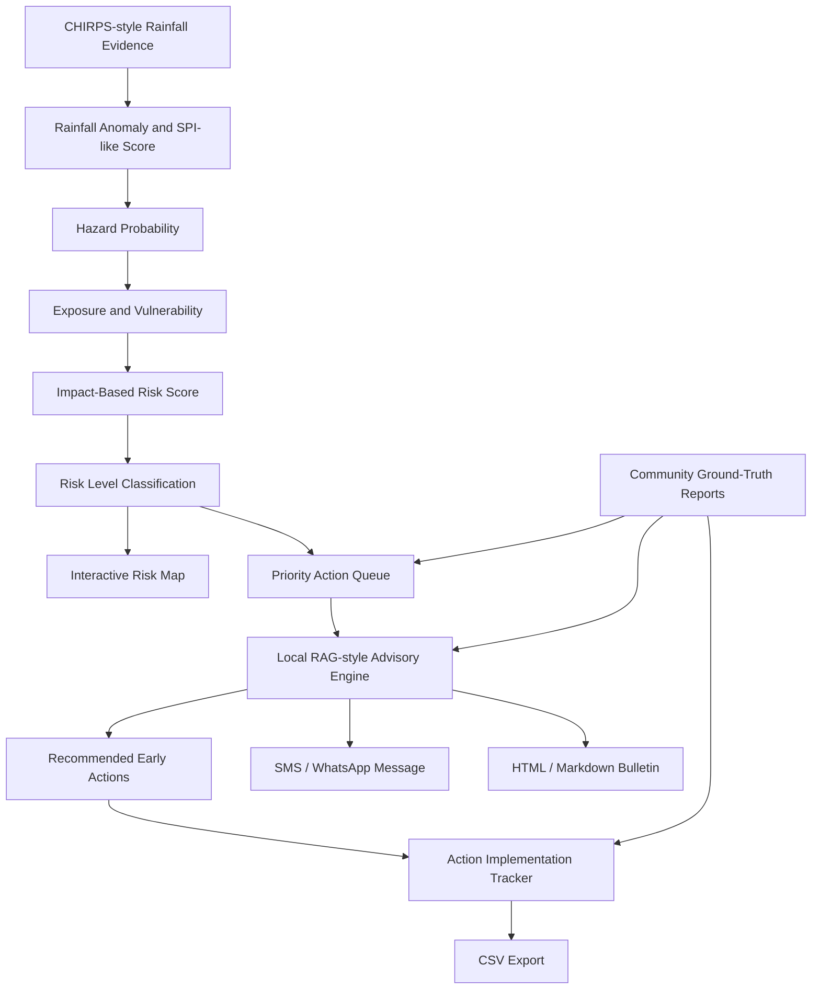

# Forecast2Action AI

**Forecast2Action AI** is an AI-enabled forecast-to-action copilot designed for impact-based early warning, anticipatory action planning, community ground-truth reporting, and operational bulletin generation across climate-risk-prone areas in the IGAD region.

The system converts climate risk signals into actionable decisions by linking rainfall anomaly evidence, exposure, vulnerability, local community reports, AI/RAG-style advisory generation, and action implementation tracking.

## Live Demo

- Frontend: https://forecast2action-ai.vercel.app
- Backend API: https://forecast2action-ai.onrender.com
- API Health Check: https://forecast2action-ai.onrender.com/api/risk

## 1. Project Summary

Climate early warning systems often stop at forecasts, maps, or risk levels. Decision-makers still need to translate those signals into clear actions, responsible sectors, deadlines, and community messages.

**Forecast2Action AI solves this gap.**

It transforms climate hazard signals into:

- impact-based district risk scores;
- interactive risk maps;
- priority action queues;
- knowledge-guided AI advisories;
- community-level SMS / WhatsApp messages;
- community ground-truth reporting;
- action implementation trackers;
- downloadable HTML / Markdown bulletins;
- CSV exports for operational follow-up.

The prototype focuses on drought, heavy rainfall, and heat stress risks for selected pilot districts in Ethiopia and Kenya.

---

## 2. Core Workflow



---

## 3. Why This Matters

Many early warning platforms provide useful forecast or hazard information, but users still ask:

- What does this mean for my district?
- Which area should be prioritized first?
- What action should be taken now?
- Who is responsible?
- What should be communicated to communities?
- Are local reports confirming the forecast signal?
- Can we generate a bulletin immediately?

Forecast2Action AI answers these questions by connecting forecast evidence to operational action.

---

## 4. Main Features

### 4.1 Climate Evidence Pipeline

The prototype uses a CHIRPS-style rainfall anomaly pipeline that generates district-level rainfall indicators:

- seasonal rainfall;
- baseline mean rainfall;
- rainfall anomaly in millimeters;
- rainfall anomaly percentage;
- SPI-like standardized rainfall score;
- hazard classification;
- hazard probability.

Current prototype data is generated as a realistic scaffold. In an operational version, this will be replaced with real CHIRPS zonal statistics.

---

### 4.2 Impact-Based Risk Scoring

Risk is calculated using four normalized components:

```text
Risk Score =
40% hazard probability
+ 25% exposure
+ 25% vulnerability
+ 10% forecast confidence
```

Risk levels are classified as:

| Score Range | Risk Level |
| ----------- | ---------- |
| < 0.35      | No alert   |
| 0.35–0.59   | Watch      |
| 0.60–0.79   | Warning    |
| ≥ 0.80      | Trigger    |

---

### 4.3 Interactive Risk Map

The dashboard includes an interactive Leaflet map showing district-level risk points.

Map markers communicate:

- district;
- country;
- hazard type;
- risk level;
- risk score;
- selected advisory.

Users can click a district on the map to update the advisory, tracker, reports, and bulletin context.

---

### 4.4 Priority Action Queue

The priority queue ranks districts using:

- risk score;
- community report signal;
- hazard type;
- risk level.

This helps decision-makers quickly identify where early action should be prioritized.

---

### 4.5 Local RAG-style Advisory Engine

The system includes a structured local Action Knowledge Base:

```text
data/knowledge/action_library.json
```

The advisory engine retrieves relevant actions using:

- hazard type;
- risk level;
- audience;
- rainfall anomaly;
- SPI-like score;
- community feedback signal.

It then generates:

- recommended early actions;
- role-specific advisory text;
- knowledge source summaries;
- retrieval explanation.

This allows the system to behave like an AI decision-support copilot while remaining transparent and locally controlled.

---

### 4.6 Audience-Specific Advisories

Users can switch between advisory audiences:

- Disaster Risk Manager;
- NGO / Anticipatory Action Planner;
- Agriculture and Livestock Extension Officer;
- Community Member.

Each audience receives action guidance tailored to its operational role.

---

### 4.7 Multilingual Community Messages

The dashboard generates SMS / WhatsApp-ready community messages in:

- English;
- Amharic;
- Swahili.

These messages are short, practical, and designed for last-mile early warning communication.

---

### 4.8 Community Ground-Truth Reporting

The system allows users to submit local field observations, including:

- water shortage;
- crop wilting;
- poor pasture condition;
- livestock stress;
- flooded roads;
- river overflow;
- unusual heat;
- disease concern;
- market disruption;
- other observations.

These reports are stored locally and used to strengthen the advisory and priority ranking.

---

### 4.9 Action Implementation Tracker

The tracker converts recommended actions into operational tasks with:

- responsible sector;
- priority;
- suggested deadline;
- implementation status;
- update timestamp;
- update user.

Statuses are persistent and saved in:

```text
data/sample/action_task_status.json
```

Supported statuses:

- Not started;
- In progress;
- Completed;
- Blocked.

---

### 4.10 Bulletin Export

The system generates downloadable early warning bulletins in:

- HTML;
- Markdown.

The HTML bulletin includes a Print / Save as PDF button.

Bulletins include:

- executive summary;
- selected district alert;
- location information;
- climate evidence;
- risk indicator values;
- priority action queue;
- recommended actions;
- action implementation tracker;
- knowledge-guided advisory basis;
- SMS / WhatsApp-ready message;
- prototype data note.

---

### 4.11 CSV Export

The Action Implementation Tracker can be exported as CSV for coordination and follow-up.

The CSV includes:

- task ID;
- district;
- country;
- hazard;
- risk level;
- audience;
- action;
- responsible sector;
- priority;
- deadline;
- status;
- update time;
- update user;
- task basis.

---

### 4.12 Interactive Seasonal Climate Raster Maps

The Climate Indicator tab of the Ethiopia Forecast Map Explorer renders real, pannable/zoomable raster maps (not static images) for:

- rainfall total, SPI, CDD, CWD, dry spell probability (≥5 / ≥7 / ≥9 days), and rainfall percentile;
- across June, July, August, September, and JJAS periods;
- as Forecast, Climatology, or Anomaly products, including a side-by-side "Forecast vs Climatology vs Anomaly" compare view.

Source rasters are GeoTIFF, NetCDF, or gridded CSV files under `data/maps/geotiff`, `data/maps/netcdf`, and `data/maps/csv`. The backend auto-detects indicator/period/product from filenames (or an optional `seasonal_raster_catalog.json`), converts non-GeoTIFF sources to a display GeoTIFF on first use, and serves Leaflet-compatible XYZ tiles with a colormap legend, per-pixel value inspection on click, and summary statistics (min/mean/max/percentiles). A static PNG map catalog (`data/maps/Seasonal`, `data/maps/Subseasonal`) is also served separately for simple image-based viewing.

Converted GeoTIFFs are cached under `data/maps/cache/seasonal_raster` (evicted automatically once the cache exceeds `SEASONAL_RASTER_CACHE_MAX_MB`, default 512 MB). `POST /api/seasonal-raster/prewarm` pre-converts and caches every map so the first user to view any indicator/period/product isn't the one who pays the conversion cost; set `SEASONAL_RASTER_PREWARM_ON_STARTUP=true` to run it automatically once at backend startup.

This feature requires the additional geospatial dependencies listed in `requirements.txt` (`rasterio`, `rio-tiler`, `pillow`, `matplotlib`, `xarray`, `rioxarray`, `netCDF4`, `h5netcdf`).

---

## 5. Current Pilot Districts

The prototype includes sample pilot districts:

| Country  | District    | Example Hazard              |
| -------- | ----------- | --------------------------- |
| Ethiopia | Borena      | Drought                     |
| Ethiopia | Afar Zone 1 | Heat stress / rainfall risk |
| Kenya    | Turkana     | Drought                     |
| Kenya    | Garissa     | Heavy rainfall              |

---

## 6. Technology Stack

### Backend

- Python
- FastAPI
- Pandas
- Pydantic
- JSON-based local storage
- CSV export
- HTML / Markdown response generation
- Rasterio, rio-tiler, xarray/rioxarray, Pillow, Matplotlib (interactive seasonal raster tile service)

### Frontend

- React
- Vite
- Leaflet
- React Leaflet
- CSS

### Data and Knowledge

- CHIRPS-style rainfall anomaly pipeline
- SPI-like rainfall indicator
- Local Action Knowledge Base
- Community reports JSON store
- Persistent task status JSON store

---

## 7. Project Structure

```text
forecast2action-ai/
│
├── app/
│   ├── api/
│   │   ├── main.py
│   │   ├── seasonal_maps.py                 # static seasonal PNG map catalog
│   │   ├── seasonal_raster_maps.py          # interactive GeoTIFF/NetCDF/CSV tile service
│   │   └── seasonal_catalog_shared.py       # shared indicator/period/product vocabulary
│   │
│   ├── advisory/
│   │   ├── __init__.py
│   │   └── rag_engine.py
│   │
│   ├── data_pipeline/
│   │   ├── load_sample_data.py
│   │   └── chirps_rainfall_pipeline.py
│   │
│   └── ml/
│       └── risk_scoring.py
│
├── data/
│   ├── knowledge/
│   │   └── action_library.json
│   │
│   ├── maps/
│   │   ├── Seasonal/            # static seasonal PNG maps
│   │   ├── Subseasonal/         # static subseasonal PNG maps
│   │   ├── geotiff/             # interactive raster sources (.tif)
│   │   ├── netcdf/              # interactive raster sources (.nc)
│   │   ├── csv/                 # interactive raster sources (gridded .csv)
│   │   └── cache/               # generated display GeoTIFFs (not committed)
│   │
│   └── sample/
│       ├── hazard_indicators.csv
│       ├── chirps_district_rainfall_timeseries.csv
│       ├── exposure_vulnerability.csv
│       ├── community_reports.json
│       └── action_task_status.json
│
├── frontend/
│   ├── src/
│   │   ├── components/
│   │   │   ├── RiskMap.jsx
│   │   │   ├── ForecastLayerMap.jsx         # hazard/risk layers + seasonal raster map explorer
│   │   │   └── AIMapInterpretation.jsx
│   │   │
│   │   ├── constants/
│   │   │   └── climateIndicators.js         # shared indicator/period/product vocabulary
│   │   │
│   │   ├── pages/
│   │   │   └── Dashboard.jsx
│   │   │
│   │   ├── styles/
│   │   │   ├── main.css
│   │   │   └── mapSwitcher.css
│   │   │
│   │   ├── App.jsx
│   │   └── main.jsx
│   │
│   ├── package.json
│   └── vite.config.js
│
├── outputs/
│   └── tables/
│       └── chirps_anomaly_summary.csv
│
└── README.md
```

---

## 8. Setup Instructions

### 8.1 Clone or Open the Project

```cmd
cd /d D:\forecast2action-ai
```

---

### 8.2 Create and Activate Python Environment

```cmd
python -m venv .venv
.venv\Scripts\activate
```

---

### 8.3 Install Backend Dependencies

```cmd
pip install fastapi uvicorn pandas pydantic
```

---

### 8.4 Generate Sample Data

```cmd
python app\data_pipeline\load_sample_data.py
```

This creates:

```text
data/sample/hazard_indicators.csv
data/sample/chirps_district_rainfall_timeseries.csv
data/sample/exposure_vulnerability.csv
outputs/tables/chirps_anomaly_summary.csv
```

---

### 8.5 Start Backend

```cmd
uvicorn app.api.main:app --reload
```

Backend runs at:

```text
http://127.0.0.1:8000
```

API documentation:

```text
http://127.0.0.1:8000/docs
```

---

### 8.6 Install Frontend Dependencies

Open another terminal:

```cmd
cd /d D:\forecast2action-ai\frontend
npm install
npm install leaflet react-leaflet
```

---

### 8.7 Start Frontend

```cmd
npm run dev
```

Frontend runs at:

```text
http://localhost:5174
```

---

## 9. Key API Endpoints

| Endpoint                             | Description                                      |
| ------------------------------------ | ------------------------------------------------ |
| `/api/risk`                          | Returns scored district risk data                |
| `/api/advisory/{district}`           | Returns RAG-style advisory for selected district |
| `/api/priority-actions`              | Returns ranked priority action queue             |
| `/api/community-reports`             | Submit or list community reports                 |
| `/api/community-feedback-summary`    | Summarizes ground-truth reports                  |
| `/api/action-tracker/{district}`     | Returns generated action tracker tasks           |
| `/api/action-tracker/status`         | Saves task status update                         |
| `/api/action-tracker/{district}/csv` | Exports action tracker as CSV                    |
| `/api/bulletin/{district}`           | Generates HTML or Markdown bulletin              |
| `/api/report-types`                  | Returns supported community report categories    |
| `/api/seasonal-maps/catalog`         | Lists static seasonal PNG maps                   |
| `/api/seasonal-raster/options`       | Lists available indicator/period/product combinations |
| `/api/seasonal-raster/map`           | Returns one interactive raster map (tiles, legend, stats) |
| `/api/seasonal-raster/compare`       | Returns Forecast/Climatology/Anomaly maps together |
| `/api/seasonal-raster/tiles/{id}/{z}/{x}/{y}.png` | Serves XYZ raster tiles for Leaflet |
| `/api/seasonal-raster/value/{id}`    | Reads the raster value at a clicked lat/lon      |
| `/api/seasonal-raster/prewarm`       | Pre-converts and caches all raster maps          |
| `/api/seasonal-raster/health`        | Diagnostics: discovered maps and source directories |

---

## 10. Example Workflow

1. Run the rainfall anomaly pipeline.
2. Open the dashboard.
3. Select a district, for example Borena.
4. Review climate evidence and SPI-like score.
5. Check the risk level and map location.
6. Review the priority queue.
7. Review the knowledge-guided advisory.
8. Submit a community report.
9. Check how ground-truth signal changes.
10. Review generated implementation tasks.
11. Change task status to In progress or Completed.
12. Download the HTML bulletin.
13. Export the tracker as CSV.

---

## 11. Demo Script

### Opening

Forecast2Action AI is an early warning copilot that helps decision-makers move from climate risk signals to practical early action.

Many systems provide forecasts, but the operational challenge is knowing what to do, who should act, and how to communicate risk to communities. Forecast2Action AI closes that gap.

### Step 1: Climate Evidence

The system starts with district-level rainfall evidence. It calculates seasonal rainfall, baseline rainfall, anomaly percentage, and an SPI-like score.

These indicators are converted into hazard probability.

### Step 2: Impact-Based Risk

The system combines hazard probability with exposure, vulnerability, and confidence to generate a district-level risk score.

The score is classified into no alert, watch, warning, or trigger.

### Step 3: Risk Map and Priority Queue

The dashboard shows the risk spatially on an interactive map.

The priority queue ranks districts based on risk and community feedback.

### Step 4: AI / RAG-style Advisory

The system retrieves relevant early action guidance from a local Action Knowledge Base.

This makes the advisory transparent, explainable, and grounded in structured knowledge.

### Step 5: Community Ground-Truth

Users can submit field observations such as water shortage, pasture stress, crop wilting, or flooded roads.

These reports influence the ground-truth signal.

### Step 6: Action Tracker

Recommended actions are converted into operational tasks with responsible sectors, priorities, deadlines, and implementation status.

Task status updates are saved and can be exported as CSV.

### Step 7: Bulletin Export

The system generates an operational early warning bulletin in HTML or Markdown.

The HTML version can be printed or saved as PDF.

### Closing

Forecast2Action AI shows how AI can help move from early warning to early action, supporting smarter decisions and stronger communities across the IGAD region.

---

## 12. Innovation

Forecast2Action AI is innovative because it combines:

- climate evidence;
- impact-based risk scoring;
- geospatial visualization;
- community ground-truth;
- local RAG-style advisory retrieval;
- multilingual messaging;
- implementation tracking;
- operational bulletin generation.

Unlike dashboards that only show risk, Forecast2Action AI supports the full decision cycle from forecast to coordinated action.

---

## 13. AI Component

The AI component is implemented as a local RAG-style advisory engine.

Instead of generating unsupported recommendations, the system retrieves relevant guidance from a structured Action Knowledge Base using:

- hazard;
- risk level;
- audience;
- rainfall anomaly;
- SPI-like score;
- community feedback signal.

The retrieved guidance is then used to produce recommended actions and role-specific advisory text.

This design is transparent, explainable, and suitable for sensitive early warning and disaster risk management contexts.

---

## 14. Current Limitations

This is a hackathon MVP. Current limitations include:

- rainfall data is CHIRPS-style prototype data, not yet live CHIRPS download;
- exposure and vulnerability values are sample indicators;
- the Action Knowledge Base is local and limited;
- community reports are stored in local JSON;
- authentication and user roles are not yet implemented;
- the tracker is file-based rather than database-backed;
- SMS / WhatsApp integration is simulated through generated message text;
- the interactive seasonal raster tile service needs its geospatial dependencies installed (see `requirements.txt`) and needs `data/maps/geotiff` and `data/maps/netcdf` present on whatever host runs the backend -- these were previously gitignored by the project's blanket `*.tif`/`*.nc` rule and had no deploy-time sync step, so a deployed backend without them shows "no map found" for the Climate Indicator tab.

---

## 15. Future Roadmap

### Near-Term

- Replace synthetic rainfall data with real CHIRPS download and zonal statistics;
- add real administrative boundaries;
- add database storage using PostgreSQL / PostGIS;
- expand Action Knowledge Base;
- add PDF generation;
- add user authentication;
- add real SMS / WhatsApp integration.

### Medium-Term

- integrate seasonal forecast inputs;
- support drought, flood, heat, disease and food security risk;
- add vulnerability layers from population, livestock, agriculture and access datasets;
- add multilingual advisory templates;
- add mobile-friendly reporting forms.

### Long-Term

- deploy as a regional early warning decision-support platform;
- integrate with NMHS, disaster risk management agencies and humanitarian partners;
- support anticipatory action trigger monitoring;
- include human-in-the-loop validation;
- scale across IGAD countries.

---

## 16. Suggested Deployment

Frontend:

```text
Vercel, Netlify, or static hosting
```

Backend:

```text
Render, Railway, Fly.io, or cloud VM
```

Operational database:

```text
PostgreSQL / PostGIS
```

---

## 17. Value for IGAD Region

Forecast2Action AI can support IGAD countries by helping:

- translate forecasts into sectoral action;
- improve coordination between climate, DRM, agriculture, livestock, water and health sectors;
- strengthen last-mile early warning communication;
- incorporate community observations into risk decisions;
- generate rapid bulletins for operational use;
- improve accountability through action tracking.

---

## 18. Project Status

Current status:

```text
Working local MVP
```

Implemented:

- FastAPI backend;
- React/Vite frontend;
- CHIRPS-style rainfall pipeline;
- impact-based risk scoring;
- interactive risk map;
- priority action queue;
- RAG-style advisory engine;
- Action Knowledge Base;
- community reports;
- persistent action tracker;
- HTML / Markdown bulletin export;
- CSV tracker export.

---

## 19. License

This prototype is prepared for hackathon demonstration and learning purposes.

License can be updated depending on the final project ownership and deployment plan.

---

## 20. Author

Developed by:

```text
Yonas Mersha
Climate, Data Science, AI/ML, GIS/Remote Sensing and Early Warning Systems Specialist
```

Project theme:

```text
Smarter Early Warning, Stronger Communities
```
