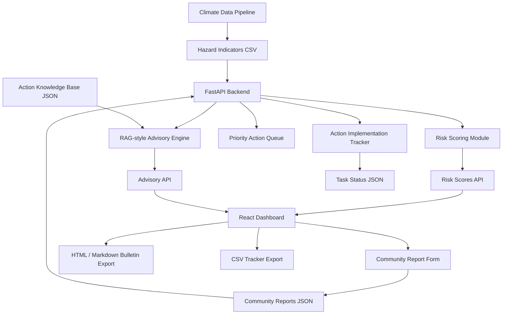
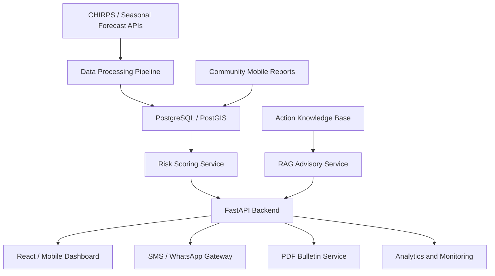

# Forecast2Action AI — Technical Architecture

## 1. Purpose of This Document

This document describes the technical architecture of **Forecast2Action AI**, a hackathon MVP that converts climate risk evidence into explainable advisories, priority actions, community messages, implementation tasks, and exportable early warning products.

The document is intended for:

- hackathon judges;
- technical reviewers;
- collaborators;
- future developers;
- deployment partners.

---

## 2. System Overview

Forecast2Action AI is designed as a modular forecast-to-action decision-support system.

The platform connects five major layers:

```text
Climate Evidence
        ↓
Impact-Based Risk Scoring
        ↓
Knowledge-Guided Advisory Generation
        ↓
Community Ground-Truth and Action Tracking
        ↓
Operational Exports and Communication
```

The current MVP uses a local FastAPI backend, a React/Vite frontend, JSON-based storage, a local Action Knowledge Base, and a CHIRPS-style rainfall anomaly pipeline.

---

## 3. High-Level Architecture



---

## 4. Main Components

### 4.1 Backend API

Backend framework:

```text
FastAPI
```

Main backend file:

```text
app/api/main.py
```

The backend provides:

- risk score API;
- advisory API;
- priority action queue API;
- community report API;
- community feedback summary API;
- action tracker API;
- persistent task status update API;
- CSV export API;
- HTML and Markdown bulletin generation API.

---

### 4.2 Frontend Dashboard

Frontend framework:

```text
React + Vite
```

Main dashboard file:

```text
frontend/src/pages/Dashboard.jsx
```

The frontend provides:

- dashboard summary cards;
- district selector;
- audience selector;
- language selector;
- interactive risk map;
- impact-based risk table;
- forecast-to-action advisory panel;
- community reporting form;
- action implementation tracker;
- bulletin download buttons;
- CSV export button.

---

### 4.3 Interactive Map

Map technology:

```text
Leaflet + React Leaflet
```

Main map component:

```text
frontend/src/components/RiskMap.jsx
```

The map shows district-level risk points and allows users to select a district directly from the map.

Each marker represents:

- district;
- country;
- hazard type;
- risk level;
- risk score.

---

## 5. Data Architecture

### 5.1 Data Folders

```text
data/
├── knowledge/
│   └── action_library.json
│
└── sample/
    ├── hazard_indicators.csv
    ├── chirps_district_rainfall_timeseries.csv
    ├── exposure_vulnerability.csv
    ├── community_reports.json
    └── action_task_status.json
```

### 5.2 Climate Evidence Data

The prototype uses CHIRPS-style rainfall indicators generated by:

```text
app/data_pipeline/chirps_rainfall_pipeline.py
```

Pipeline runner:

```text
app/data_pipeline/load_sample_data.py
```

Generated climate evidence includes:

- country;
- district;
- year;
- season;
- rainfall amount;
- baseline rainfall mean;
- baseline rainfall standard deviation;
- rainfall anomaly in millimeters;
- rainfall anomaly percentage;
- SPI-like score;
- hazard type;
- hazard probability;
- exposure;
- vulnerability;
- confidence;
- latitude;
- longitude.

---

## 6. Climate Evidence Pipeline

The climate evidence pipeline produces district-level indicators.

Current MVP workflow:

```text
Sample district configuration
        ↓
CHIRPS-style rainfall time series generation
        ↓
Baseline rainfall statistics
        ↓
Current season rainfall anomaly
        ↓
SPI-like standardized rainfall score
        ↓
Hazard classification
        ↓
Hazard probability estimation
        ↓
Hazard indicator CSV
```

Main output:

```text
data/sample/hazard_indicators.csv
```

Additional output:

```text
outputs/tables/chirps_anomaly_summary.csv
```

In a production version, this pipeline can be replaced with a real CHIRPS workflow:

```text
CHIRPS download
        ↓
Administrative boundary overlay
        ↓
District zonal statistics
        ↓
Seasonal aggregation
        ↓
Anomaly and SPI calculation
        ↓
Risk pipeline ingestion
```

---

## 7. Risk Scoring Architecture

Risk scoring is handled by:

```text
app/ml/risk_scoring.py
```

The current formula is:

```text
Risk Score =
0.40 × hazard_probability
+ 0.25 × exposure
+ 0.25 × vulnerability
+ 0.10 × confidence
```

Risk levels:

| Risk Score | Risk Level |
|---:|---|
| < 0.35 | no_alert |
| 0.35–0.59 | watch |
| 0.60–0.79 | warning |
| ≥ 0.80 | trigger |

This design follows the logic of impact-based forecasting by combining:

- hazard;
- exposure;
- vulnerability;
- confidence.

---

## 8. Advisory Architecture

### 8.1 RAG-style Advisory Engine

The advisory engine is located in:

```text
app/advisory/rag_engine.py
```

The engine retrieves relevant advisory guidance from:

```text
data/knowledge/action_library.json
```

The current approach is a **local RAG-style retrieval engine**. It does not depend on an external LLM API. Instead, it uses structured retrieval rules to select the best matching guidance.

### 8.2 Retrieval Inputs

The retrieval engine uses:

- district;
- country;
- hazard type;
- risk level;
- target audience;
- risk score;
- hazard probability;
- rainfall anomaly percentage;
- SPI-like score;
- exposure;
- vulnerability;
- forecast confidence;
- community feedback signal.

### 8.3 Retrieval Outputs

The advisory engine returns:

- retrieved knowledge items;
- retrieval scores;
- recommended early actions;
- role-specific advisory;
- knowledge source summary;
- retrieval explanation.

### 8.4 Advisory API

Endpoint:

```text
/api/advisory/{district}
```

Query parameters:

```text
audience
language
```

Example:

```text
/api/advisory/Borena?audience=disaster_manager&language=en
```

---

## 9. Action Knowledge Base

The local Action Knowledge Base is stored in:

```text
data/knowledge/action_library.json
```

Each knowledge item includes:

- ID;
- hazard type;
- risk level;
- audience;
- sector;
- title;
- rationale;
- recommended actions;
- source title;
- source note.

Example structure:

```json
{
  "id": "drought_trigger_disaster_manager_001",
  "hazard": "drought",
  "risk_level": "trigger",
  "audience": "disaster_manager",
  "sector": "Disaster Risk Management",
  "title": "Activate drought anticipatory action coordination",
  "rationale": "Severe rainfall deficit and high exposure require immediate coordination before impacts worsen.",
  "actions": [
    "Activate a district drought coordination meeting.",
    "Verify water-point status and pasture condition.",
    "Prioritize high-exposure communities for early action support."
  ],
  "source_title": "Forecast2Action drought anticipatory action guidance",
  "source_note": "Prototype local knowledge item."
}
```

This design allows new guidance to be added without rewriting the advisory engine.

---

## 10. Audience-Specific Advisory Flow

Users can select different target audiences:

- Disaster Risk Manager;
- NGO / Anticipatory Action Planner;
- Agriculture and Livestock Extension Officer;
- Community Member.

The selected audience changes:

- retrieved knowledge items;
- recommended actions;
- advisory language;
- action tracker task context;
- CSV export filename;
- bulletin audience label.

Workflow:

```text
User selects audience
        ↓
Frontend calls advisory API
        ↓
Backend retrieves audience-relevant knowledge
        ↓
Advisory response updates dashboard
        ↓
Action tracker regenerates audience-specific tasks
```

---

## 11. Multilingual Message Flow

The system currently supports simple community messages in:

- English;
- Amharic;
- Swahili.

Workflow:

```text
User selects language
        ↓
Frontend calls advisory API with language parameter
        ↓
Backend returns SMS / WhatsApp-ready message
        ↓
Dashboard displays the message
        ↓
Bulletin includes the selected message
```

In a production version, this can be improved with validated translation templates and institutional language review.

---

## 12. Community Ground-Truth Architecture

Community reports are stored in:

```text
data/sample/community_reports.json
```

The community report form collects:

- country;
- district;
- report type;
- severity;
- description;
- reporter name;
- contact;
- optional latitude;
- optional longitude.

### 12.1 Community Report API

Submit report:

```text
POST /api/community-reports
```

List reports:

```text
GET /api/community-reports
```

Feedback summary:

```text
GET /api/community-feedback-summary
```

### 12.2 Feedback Signal Logic

The backend summarizes reports into a feedback signal:

| Condition | Feedback Signal |
|---|---|
| No reports | no_ground_signal |
| Some reports | limited_ground_signal |
| Several reports | emerging_ground_signal |
| Several high-severity reports | strong_ground_signal |

The feedback signal is used by:

- priority action queue;
- advisory engine;
- role-specific advisory;
- action planning context.

---

## 13. Priority Action Queue Architecture

Endpoint:

```text
/api/priority-actions
```

The priority queue combines:

- risk score;
- risk level;
- community feedback signal;
- community report count;
- rainfall anomaly percentage;
- SPI-like score.

The system ranks districts by priority score.

Priority queue workflow:

```text
Risk scores
        ↓
Community feedback summary
        ↓
Feedback boost
        ↓
Priority score
        ↓
Ranked action queue
```

The queue helps decision-makers quickly identify where attention is needed first.

---

## 14. Action Implementation Tracker Architecture

Endpoint:

```text
/api/action-tracker/{district}
```

The action tracker converts advisory recommendations into operational tasks.

Each task includes:

- task ID;
- rank;
- district;
- country;
- hazard;
- risk level;
- audience;
- action;
- responsible sector;
- priority;
- suggested deadline;
- implementation status;
- update timestamp;
- update user;
- task basis.

### 14.1 Task Generation Logic

Tasks are generated from recommended advisory actions.

For each action, the backend infers:

- responsible sector;
- priority;
- suggested deadline;
- basis.

Example:

```text
Action: Verify water-point status
Responsible sector: Water Office / Disaster Risk Management
Priority: Urgent
Deadline: Within 48 hours
Status: Not started
```

### 14.2 Persistent Task Status

Task statuses are stored in:

```text
data/sample/action_task_status.json
```

Status update endpoint:

```text
PATCH /api/action-tracker/status
```

Supported statuses:

- Not started;
- In progress;
- Completed;
- Blocked.

Status persistence workflow:

```text
User changes task status
        ↓
Frontend sends PATCH request
        ↓
Backend validates status
        ↓
Backend writes task status JSON
        ↓
Action tracker reloads saved status
```

---

## 15. Export Architecture

### 15.1 Bulletin Export

Endpoint:

```text
/api/bulletin/{district}
```

Supported formats:

```text
html
markdown
```

Example:

```text
/api/bulletin/Borena?audience=disaster_manager&language=en&output_format=html
```

The bulletin includes:

- executive summary;
- selected district alert;
- district location;
- climate evidence;
- risk indicator values;
- priority action queue;
- recommended early actions;
- action implementation tracker;
- why this alert;
- community ground-truth signal;
- role-specific advisory;
- knowledge-guided advisory basis;
- SMS / WhatsApp-ready community message;
- prototype data note.

### 15.2 CSV Export

Endpoint:

```text
/api/action-tracker/{district}/csv
```

The CSV export includes:

- rank;
- task ID;
- district;
- country;
- hazard;
- risk level;
- audience;
- action;
- responsible sector;
- priority;
- suggested deadline;
- status;
- updated time;
- updated by;
- task basis.

This supports operational follow-up and sharing with coordination teams.

---

## 16. Frontend State Flow

The dashboard stores and updates:

- risk data;
- selected district;
- selected audience;
- selected language;
- advisory response;
- community reports;
- feedback summary;
- priority actions;
- action tracker;
- task statuses.

Main frontend logic:

```text
Load risk data
        ↓
Select default district
        ↓
Fetch advisory
        ↓
Fetch community feedback
        ↓
Fetch action tracker
        ↓
Render dashboard sections
```

When the user changes district, audience, or language:

```text
Update selected value
        ↓
Reload advisory
        ↓
Reload community feedback
        ↓
Reload action tracker
        ↓
Update UI
```

---

## 17. Backend API Summary

| Endpoint | Method | Purpose |
|---|---|---|
| `/` | GET | API health message |
| `/api/risk` | GET | Returns scored district risk data |
| `/api/advisory/{district}` | GET | Returns advisory and knowledge retrieval results |
| `/api/priority-actions` | GET | Returns ranked priority action queue |
| `/api/community-reports` | GET | Lists community reports |
| `/api/community-reports` | POST | Submits community report |
| `/api/community-feedback-summary` | GET | Returns feedback signal summary |
| `/api/action-tracker/{district}` | GET | Returns generated action tracker tasks |
| `/api/action-tracker/status` | PATCH | Updates and persists task status |
| `/api/action-tracker/{district}/csv` | GET | Exports action tracker CSV |
| `/api/bulletin/{district}` | GET | Exports HTML or Markdown bulletin |
| `/api/report-types` | GET | Returns supported report categories |

---

## 18. Current Local Storage Design

The MVP uses lightweight file-based storage:

| File | Purpose |
|---|---|
| `hazard_indicators.csv` | district-level risk input indicators |
| `community_reports.json` | submitted community reports |
| `action_task_status.json` | saved task status updates |
| `action_library.json` | local advisory knowledge base |

This is simple and transparent for a hackathon MVP.

For production, this should be migrated to:

```text
PostgreSQL / PostGIS
```

---

## 19. Production Architecture Roadmap

A production version could use the following architecture:



Potential production upgrades:

- real CHIRPS and seasonal forecast ingestion;
- administrative boundary zonal statistics;
- PostgreSQL/PostGIS database;
- user authentication and role management;
- SMS / WhatsApp gateway integration;
- PDF generation service;
- mobile reporting application;
- audit logs;
- country-specific early action protocols;
- secure deployment.

---

## 20. Security and Governance Considerations

For production use, the system should include:

- authentication;
- role-based access control;
- data validation;
- audit logs;
- source attribution for advisory guidance;
- human-in-the-loop approval;
- privacy safeguards for community reports;
- data retention policy;
- institutional review of multilingual messages.

Because early warning advisories can influence real-world decisions, AI-generated guidance should remain transparent, reviewed, and explainable.

---

## 21. Scalability

Forecast2Action AI is scalable because:

- hazards can be added through the data pipeline;
- districts can be added through CSV or database inputs;
- knowledge items can be added to the Action Knowledge Base;
- the frontend can render new areas dynamically;
- task tracking can be expanded to database-backed workflows;
- multilingual message templates can be extended.

The architecture can support more countries and hazards with limited restructuring.

---

## 22. Summary

Forecast2Action AI is built around a practical operational chain:

```text
Climate evidence
→ Risk score
→ Risk map
→ Priority queue
→ Knowledge-guided advisory
→ Community reports
→ Action tracker
→ Bulletin and CSV exports
```

This architecture demonstrates how AI can support transparent, actionable, and community-centered early warning workflows in the IGAD region.
